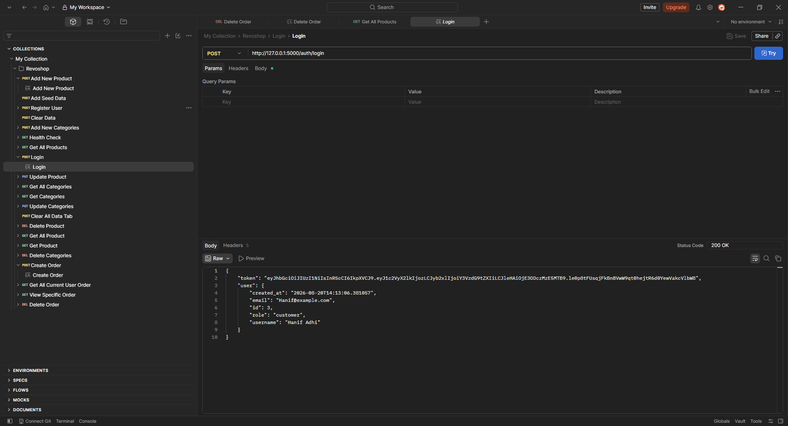
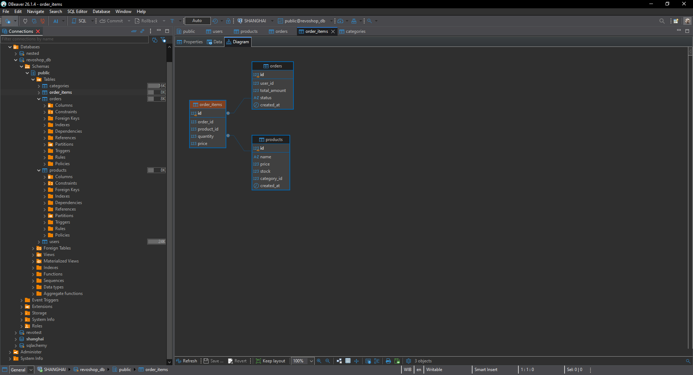

# RevoShop — REST API

RevoShop is a back-end REST API for an online store platform specializing in car parts and modifications. It provides endpoints for managing products, categories, orders, and users, with JWT-based authentication protecting order operations.

---

## ✨ Features Implemented

- **Full CRUD** for Products, Categories, and Orders (Create, Read, Update, Delete).
- **Many-to-Many relationship** between Orders and Products through the `order_items` association table (stores quantity and price per item).
- **JWT Authentication** — order endpoints are protected; each user can only access their own orders.
- **Data Validation** — required fields are checked before creating or updating resources; meaningful error messages are returned for missing or invalid data.
- **Error Handling with try/except** — database operations are wrapped in try/except blocks with automatic rollback on failure.
- **Deletion Guard** — attempting to delete a product that is still linked to active orders will be blocked by the foreign-key constraint, returning an appropriate error instead of corrupting data.
- **User Roles** — a `role` column on the `users` table (default `customer`) supports role-based access control.
- **Stock Management** — placing an order automatically reduces the stock of each ordered product.

---

## 🛠️ Technologies Used

| Layer | Technology |
|-------|-----------|
| Framework | Flask |
| ORM | SQLAlchemy (Flask-SQLAlchemy) |
| Migrations | Flask-Migrate (Alembic) |
| Database | PostgreSQL |
| DB Admin Tool | pgAdmin |
| Authentication | PyJWT |
| Environment Variables | python-dotenv |
| Production Server | Gunicorn |
| Testing | pytest |
| Load Testing | Locust |

---

## 🚀 How to Run the Project Locally

### 1. Clone the repository

```bash
git clone https://github.com/<your-username>/module-2-aldidws.git
cd module-2-aldidws
```

### 2. Create and activate a virtual environment

```bash
python -m venv venv

# Windows
venv\Scripts\activate

# macOS / Linux
source venv/bin/activate
```

### 3. Install dependencies

```bash
pip install -r requirements.txt
```

### 4. Configure environment variables

Create a `.env` file in the project root (use `.env.example` as a reference):

```
FLASK_APP=app.py
FLASK_ENV=development
DATABASE_URL=postgresql://postgres:<password>@localhost:5432/revoshop_db
SECRET_KEY=your-secret-key
```

### 5. Create the database

Open pgAdmin or your preferred SQL tool and create a database named `revoshop_db`.

### 6. Run migrations

```bash
flask db upgrade
```

### 7. Start the development server

```bash
flask run
```

The API will be available at `http://localhost:5000`.

---

## 📸 Screenshots

### Postman — Users

| Method | Description | Screenshot |
|--------|-------------|------------|
| POST | Register a new user |  |
| POST | Login |  |

### Postman — Products

| Method | Description | Screenshot |
|--------|-------------|------------|
| GET | List all products |  |
| GET | Get a specific product |  |
| POST | Create a new product |  |
| PUT | Update a product |  |
| DELETE | Delete a product |  |

### Postman — Categories

| Method | Description | Screenshot |
|--------|-------------|------------|
| GET | List all categories |  |
| GET | Get a specific category |  |
| POST | Create a new category |  |
| PUT | Update a category |  |
| DELETE | Delete a category |  |

### Postman — Orders

| Method | Description | Screenshot |
|--------|-------------|------------|
| GET | List all orders for the current user |  |
| GET | View a specific order |  |
| POST | Place a new order |  |
| DELETE | Delete an order |  |

### pgAdmin — Database Tables

| View | Screenshot |
|------|------------|
| Table Diagram / ERD |  |
| Order Items table |  |
| Role column on Users |  |

---

## 📁 Project Structure

```
module-2-aldidws/
├── app/
│   ├── __init__.py          # App factory, extensions, blueprint registration
│   ├── models/
│   │   ├── user.py          # User model (with role)
│   │   ├── product.py       # Product model
│   │   ├── category.py      # Category model
│   │   ├── order.py         # Order model
│   │   └── order_item.py    # order_items association table
│   └── routes/
│       ├── users.py         # Register & login endpoints
│       ├── products.py      # CRUD products
│       ├── categories.py    # CRUD categories
│       ├── orders.py        # CRUD orders (JWT-protected)
│       ├── seed.py          # Seed data endpoint
│       └── health.py        # Health-check endpoint
├── migrations/              # Alembic migration scripts
├── Schema/
│   ├── schema.sql           # DDL scripts
│   ├── seed.sql             # Sample data
│   └── queries.sql          # Example queries
├── Image/                   # Screenshots for documentation
│   ├── users/               # User endpoint screenshots
│   ├── products/            # Product endpoint screenshots
│   ├── categories/          # Category endpoint screenshots
│   ├── orders/              # Order endpoint screenshots
│   └── database/            # pgAdmin / ERD screenshots
├── app.py                   # Application entry point
├── requirements.txt         # Python dependencies
└── README.md
```

---

## 📝 API Endpoints Overview

| Resource | Method | Endpoint | Auth |
|----------|--------|----------|------|
| Users | POST | `/users/register` | No |
| Users | POST | `/users/login` | No |
| Products | GET | `/products` | No |
| Products | GET | `/products/<id>` | No |
| Products | POST | `/products` | No |
| Products | PUT | `/products/<id>` | No |
| Products | DELETE | `/products/<id>` | No |
| Categories | GET | `/categories` | No |
| Categories | GET | `/categories/<id>` | No |
| Categories | POST | `/categories` | No |
| Categories | PUT | `/categories/<id>` | No |
| Categories | DELETE | `/categories/<id>` | No |
| Orders | GET | `/orders` | JWT |
| Orders | GET | `/orders/<id>` | JWT |
| Orders | POST | `/orders` | JWT |
| Orders | DELETE | `/orders/<id>` | JWT |
| Health | GET | `/health` | No |
